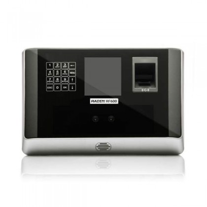

# Raden RF900

**Extends [`RadenRF800`](../raden-rf800/README.md) API**

[string]: https://developer.mozilla.org/en-US/docs/Web/JavaScript/Reference/Global_Objects/String
[boolean]: https://developer.mozilla.org/en-US/docs/Web/JavaScript/Reference/Global_Objects/Boolean
[number]: https://developer.mozilla.org/en-US/docs/Web/JavaScript/Reference/Global_Objects/Number
[object]: https://developer.mozilla.org/en-US/docs/Web/JavaScript/Reference/Global_Objects/Object
