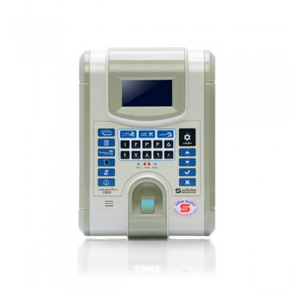

# V800




## Table of Contents <!-- omit in toc -->

- [Test Connection](#test-connection)

## Test Connection

command: `test:connection`

> no params

*Example Request*:

```json
{
  "device": {
    "host": "192.168.20.20",
    "port": 9922,
    "type": "V800",
    "password": "123"
  },
  "command": "test:connection"
}
```

*Example Response*:

```http
HTTP/1.1 200 Ok

{
  "message": "Connection Successful"
}
```

[string]: https://developer.mozilla.org/en-US/docs/Web/JavaScript/Reference/Global_Objects/String
[boolean]: https://developer.mozilla.org/en-US/docs/Web/JavaScript/Reference/Global_Objects/Boolean
[number]: https://developer.mozilla.org/en-US/docs/Web/JavaScript/Reference/Global_Objects/Number
[object]: https://developer.mozilla.org/en-US/docs/Web/JavaScript/Reference/Global_Objects/Object
